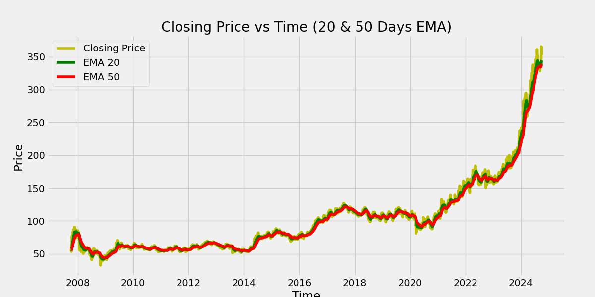
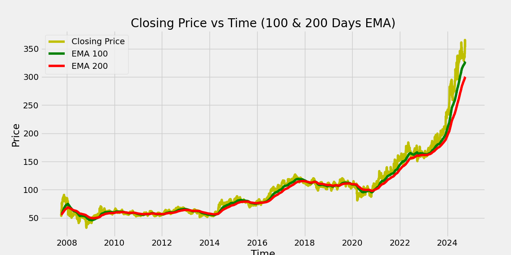
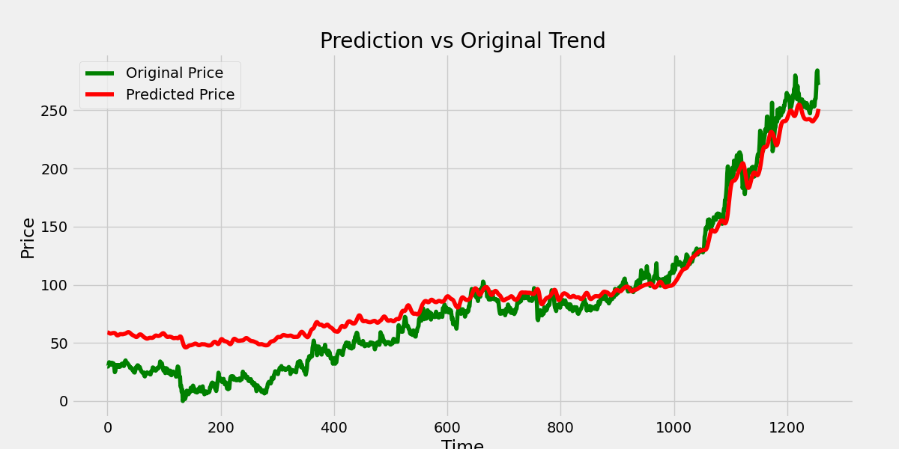

# Stock Market Prediction

A Flask web app that predicts stock price trends using an LSTM (Long Short-Term Memory) deep learning model. Enter any stock ticker (e.g. `AAPL`, `POWERGRID.NS`) and the app pulls historical price data, runs it through a pre-trained neural network, and shows you how well the model's predictions track the real price.

## What This Project Does

Stock prices are a classic time-series problem: today's price depends heavily on recent history. This project:

1. **Fetches live historical data** for any ticker using `yfinance` (Yahoo Finance).
2. **Computes Exponential Moving Averages (EMA)** at 20/50-day and 100/200-day windows — these smooth out daily noise and are commonly used by traders to spot trend direction and crossovers.
3. **Feeds the last 100 days of price data into an LSTM model**, which was pre-trained (see the included Jupyter notebook) to learn patterns in sequential price movements.
4. **Predicts prices over the test period** and plots them against the actual prices, so you can visually judge how closely the model tracks reality.
5. **Renders everything in a simple Bootstrap web UI** and lets you download the underlying dataset as a CSV.

## Demo

| EMA 20/50 | EMA 100/200 | Prediction vs Actual |
|---|---|---|
|  |  |  |

## Why LSTM?

Regular feedforward neural networks treat each input independently — they have no memory of what came before. LSTMs are a type of recurrent neural network built specifically to remember patterns over a sequence (like the last 100 days of closing prices) and carry that context forward, which makes them a natural fit for time-series data like stock prices.

## Tech Stack

- **Backend:** Flask
- **Machine Learning:** TensorFlow / Keras (LSTM), scikit-learn (`MinMaxScaler` for feature scaling)
- **Data:** `yfinance`, `pandas`, `numpy`
- **Visualization:** `matplotlib`
- **Frontend:** HTML + Bootstrap

## Project Structure

```
.
├── app.py                        # Flask app & prediction pipeline
├── stock_dl_model.h5              # Pre-trained LSTM model
├── templates/
│   └── index.html                 # Web UI
├── static/                        # Generated charts & datasets
├── powergrid.csv                  # Sample dataset
├── Stock Price Prediction .ipynb  # Notebook used to train the model
└── requirements.txt
```

## Getting Started

### Prerequisites
- Python 3.10+

### Installation

```bash
git clone https://github.com/Subham-Biswal3109/stock-market-prediction.git
cd stock-market-prediction
python -m venv venv
source venv/bin/activate   # On Windows: venv\Scripts\activate
pip install -r requirements.txt
```

### Run

```bash
python app.py
```

Open `http://127.0.0.1:5000` in your browser, type in a stock ticker (e.g. `AAPL` or `POWERGRID.NS`), and hit submit.

## How the Prediction Pipeline Works (Step by Step)

1. **Download data** — historical prices for the requested ticker are pulled from 2000-01-01 to 2024-10-01.
2. **Split** — 70% of the data is used for training context, the remaining 30% for testing/prediction.
3. **Scale** — prices are normalized to a 0–1 range with `MinMaxScaler`, since neural networks train better on scaled inputs.
4. **Window the data** — for every prediction point, the previous 100 days become the model's input sequence (this is why the last 100 training days are prepended to the test set — the model needs that lookback window even for the very first test prediction).
5. **Predict** — the pre-trained LSTM (`stock_dl_model.h5`) outputs a scaled prediction for each window.
6. **Inverse-scale** — predictions are converted back from the 0–1 range into real price values.
7. **Plot & serve** — three charts (EMA 20/50, EMA 100/200, prediction vs actual) are generated and rendered in the browser, plus a downloadable CSV of the raw dataset.

## Limitations & Notes

- The model was trained on a limited set of tickers and date ranges — it's a learning/demo project, not a production trading signal.
- **This is not financial advice.** Stock prices are influenced by far more than historical price patterns (news, earnings, macroeconomics, sentiment), none of which this model sees.
- Charts and the dataset CSV in `static/` are regenerated on every request, so old ones get overwritten.

## License

No license has been added yet — all rights reserved by default until one is chosen.

## Author

**Subham Biswal**
GitHub: [@Subham-Biswal3109](https://github.com/Subham-Biswal3109)
